# HomeWork-Lesson2
Clone remote repository
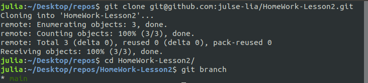

Create and checkout to my-updates branch
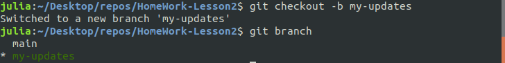

Create file survey.html
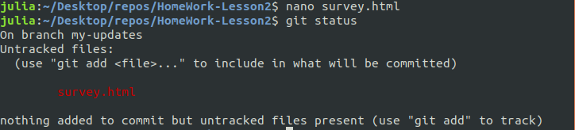

Add the file in the working directory to the staging area and capture a snapshot of the project's currently staged changes

Add more commits to my-updates history
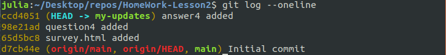

Viewing an old revision
**git checkout**
Make working directory match the exact state of the previous commit 98e21ad
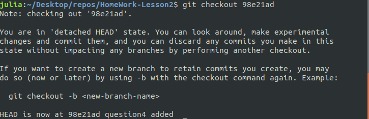

As a result, commit history looks like:
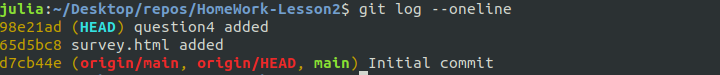

To get back to the “current” state of our project:

Push changes to remote repository
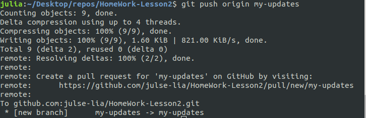

**git clean**
Create some files and directories to track and untrack
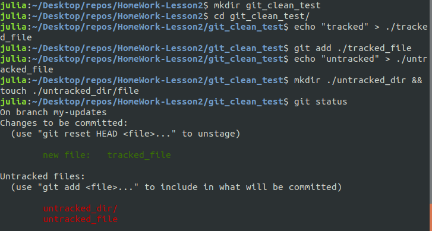

Perform a “dry run” of git clean to show which files are going to be removed without actually removing them

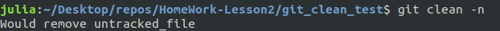

This commands shows untracked directories too
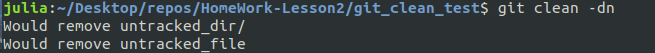

Perform git clean with options to remove files and directories separately
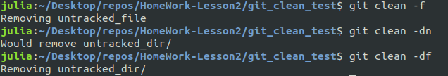

**git clean -di**
Create some files and directories to untrack again and see git status

Interactive mode or git clean interactive
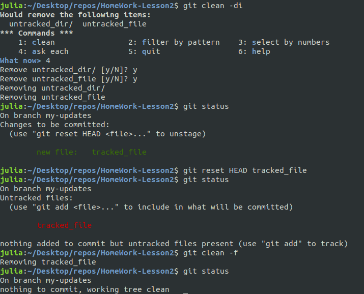

**git revert**
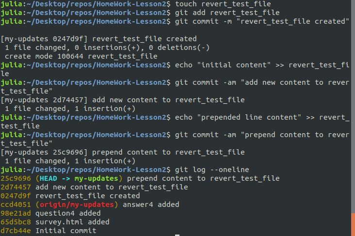

Revert latest commit and as a result “prepend line content” line was removed from file

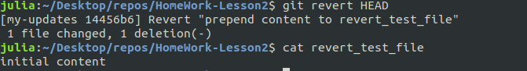

Output git status
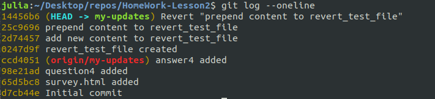

**git reset**
Create reset_lifecycle_file, add the file to the staging area and make a commit
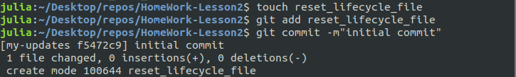

*The working directory*
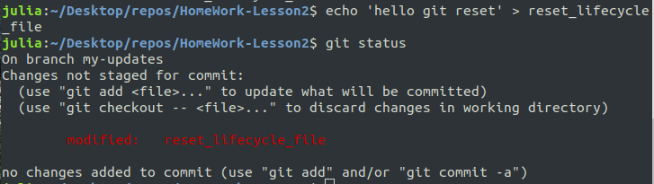

*Staging index*
The git ls-files command is essentially a debug utility for inspecting the state of the Staging Index tree

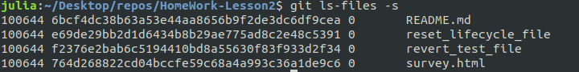

The object SHA for reset_lifecycle_file has been updated from e69de29bb2d1d6434b8b29ae775ad8c2e48c5391 to d7d77c1b04b5edd5acfc85de0b592449e5303770

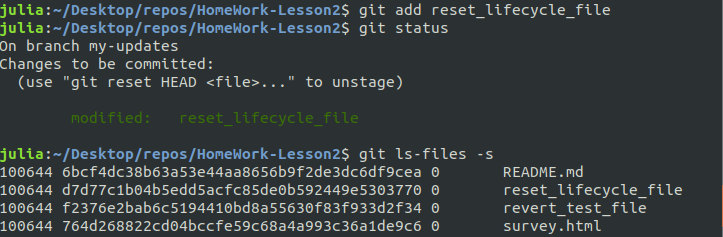

*Commit history*
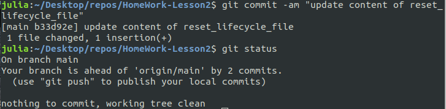

**git reset --hard**
Create a new file named new_file and add it to the repo. And modify the content of reset_lifecycle_file:

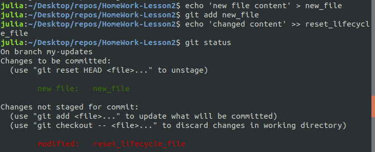

Examine the state of the Staging Index
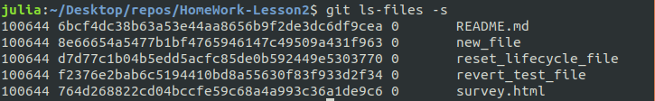

After git reset –hard command we can see that state of Index Stage has been reset to a point before new_file was added. Modifications to reset_lifecycle_file and the addition of new_file have been destroyed.

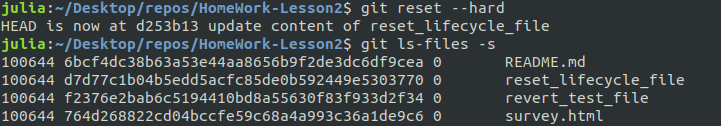

**git reset --mixed**
Again, add a new_file and modify the contents of reset_lifecycle_file. These changes are then applied to the Staging Index with git add

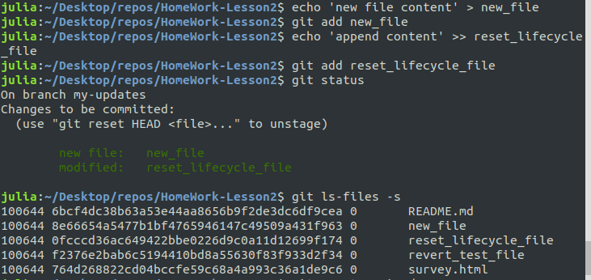

Execute the reset –mixed
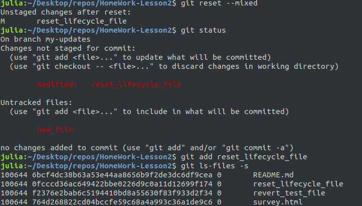

The Staging Index has been reset to a state where reset_lifecycle_file is the only file in the index. The object SHA for reset_lifecycle_file has been reset to the previous version. The Staging Index has been reset and the pending changes have been moved into the Working Directory.

**git reset --soft**
Add reset_lifecycle_file and commit 
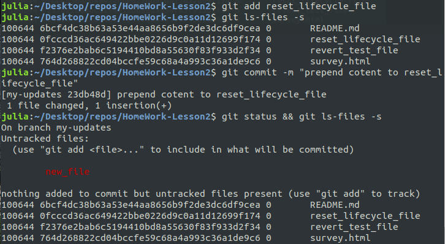

View commit history before git reset --soft
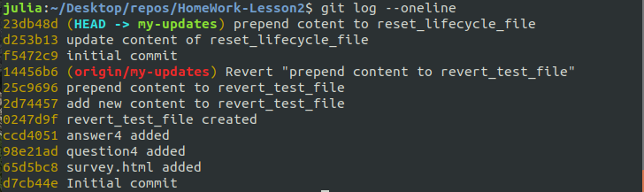

git reset –-soft d253b13
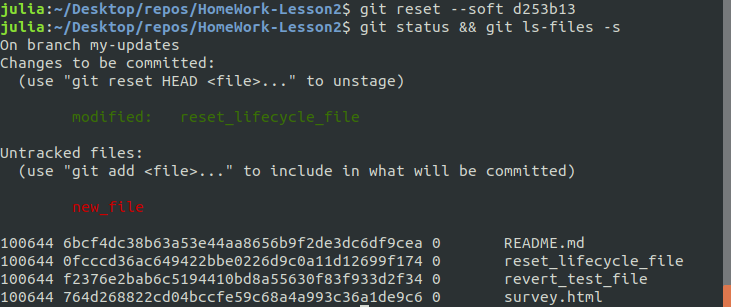

Commit Tree was moved back by one commit
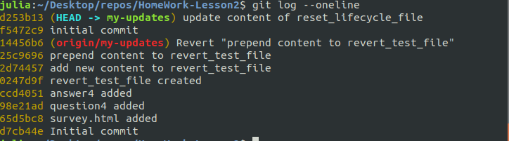

**git commit –-amend**
View git status
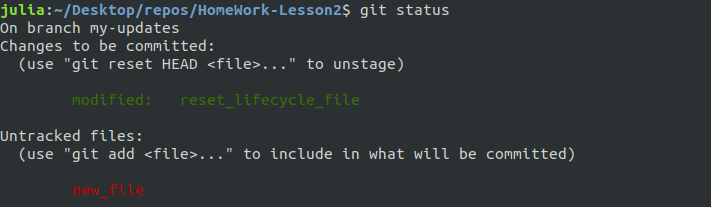

Use git commit –amend to add new_file to commit
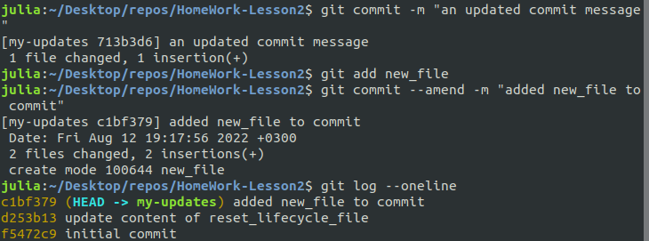

**git rebase**
Create and swith to the new branch featureB from main 
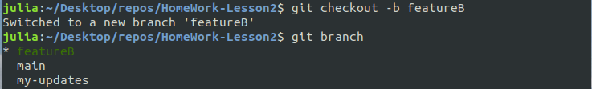

Make several commits at featureB branch
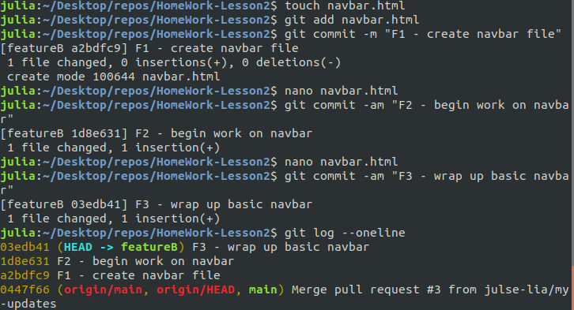

Push changes to the remote repository
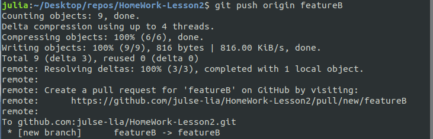

Checkout to main and update it
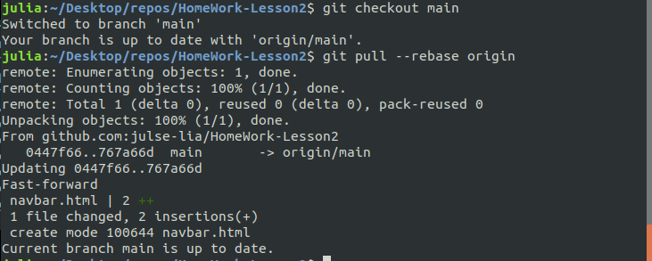

Checkout to my-updates branch and make changes to it
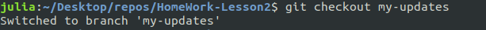

Create two commits

Current commit history at my-updates branch 
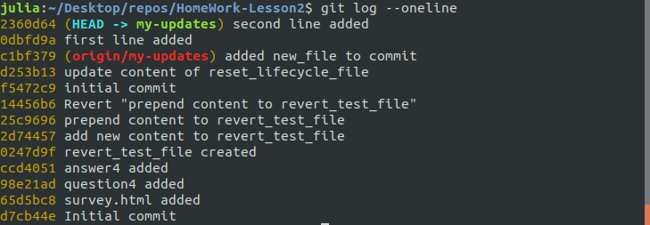

Make git rebase from main to get missing commits
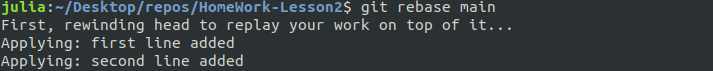

After rebase command changes from featureB branch appear at my-updates branch right beneath two new commits made before this command 

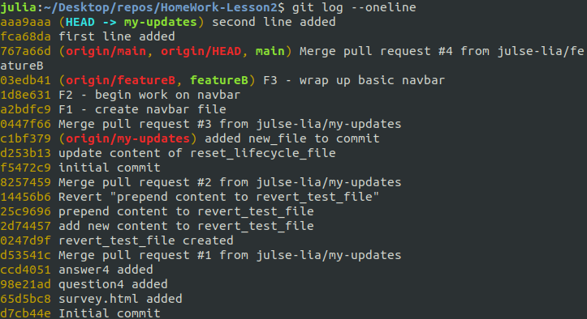

Besided previous commits SHA changed from
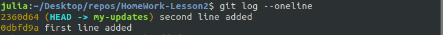
to
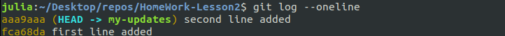
**rebase -i**
Add 5 files to repo and commit changes. As a result we have 5 commits

Some of them are in wrong order and have typo that can be corrected with rebase -i
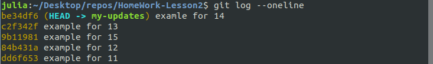

Make git rebasase -i 767a66d command with commit hash just right before problem occurred and next window is open

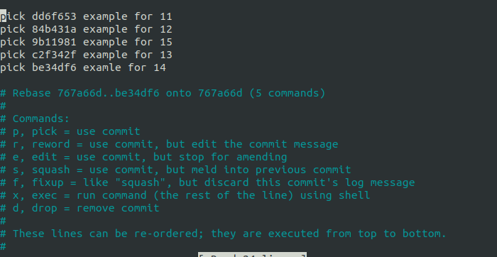

Then use command pick to change the order of commits and reword to edit commit message

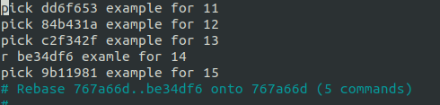

Then commit message can be changed in the opened window
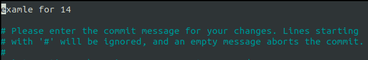

Finally here is such commit history
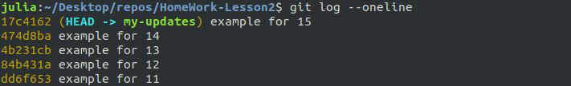

Then squash all five commits into one with squash command
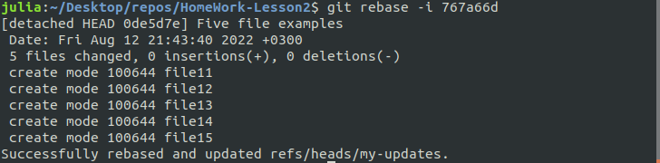

Squash four commits at the top one
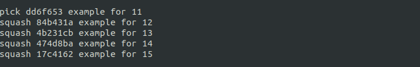

As a result here is one commit instead of five
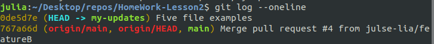

